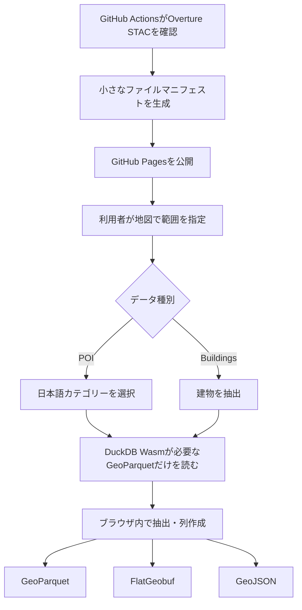

# Overture Maps データ取得

Overture MapsのPOIとBuildingsを、地図またはbboxで範囲指定して取得する日本語Webアプリです。GitHub Pages上で公開し、抽出処理は利用者のブラウザ内で完結します。

## 主な機能

- 地図の表示範囲またはbboxによる範囲指定
- POIとBuildingsの選択
- POIの日本語7分類と個別カテゴリーの複数選択
- `names.primary`からの施設名作成
- POIへの次の列の追加
  - `施設名`
  - `生活機能区分`
  - `食料品施設区分`
  - `Overture主要カテゴリー`
- GeoParquet、FlatGeobuf、GeoJSON出力
- 最新Overtureリリースへの日次追従
- アカウント登録、サーバー保存、有料APIなし

## データの流れ



## 無料で運用できる理由

GitHub PagesはHTML、CSS、JavaScriptとマニフェストだけを配信します。Overtureの元データや利用者が作成したファイルをGitHubへ保存しません。DuckDB WasmがOverture公式の公開GeoParquetを必要な範囲だけ読み、完成ファイルを利用者のブラウザから直接保存します。

## 制限

- POIは概算15,000 km²以下、Buildingsは概算3,000 km²以下に制限しています。
- FlatGeobufとGeoJSONはブラウザのメモリを考慮し、20万件以下に制限しています。
- それを超えるデータにはGeoParquetを使用してください。
- 公共交通など一部のOvertureカテゴリーは、日本国内の全施設を網羅するものではありません。
- Overtureのカテゴリーやスキーマ変更により、分類設定の更新が必要になる場合があります。

## ローカル開発

Node.js 22とPython 3.12を使用します。

```bash
npm install
python scripts/update_manifest.py
npm run dev
```

テストと本番ビルドは次のとおりです。

```bash
npm test
npm run build
```

## GitHub Pages

`.github/workflows/deploy-pages.yml`が次の場合にビルドと公開を行います。

- `main`へのpush
- 手動実行
- 日次スケジュール

リポジトリのSettings → Pages → Sourceを`GitHub Actions`に設定してください。

## データとライセンス

- Overture Maps data: Overture Maps Foundation
- OpenStreetMap: © OpenStreetMap contributors
- アプリケーションコード: MIT License

Overtureのテーマ別ライセンスと帰属表示は、[公式のAttribution and Licensing](https://docs.overturemaps.org/attribution/)を確認してください。

## プライバシー

このアプリは利用者登録、アクセス範囲の保存、取得ファイルのアップロードを行いません。抽出条件と完成データは利用者のブラウザ内だけで処理されます。
