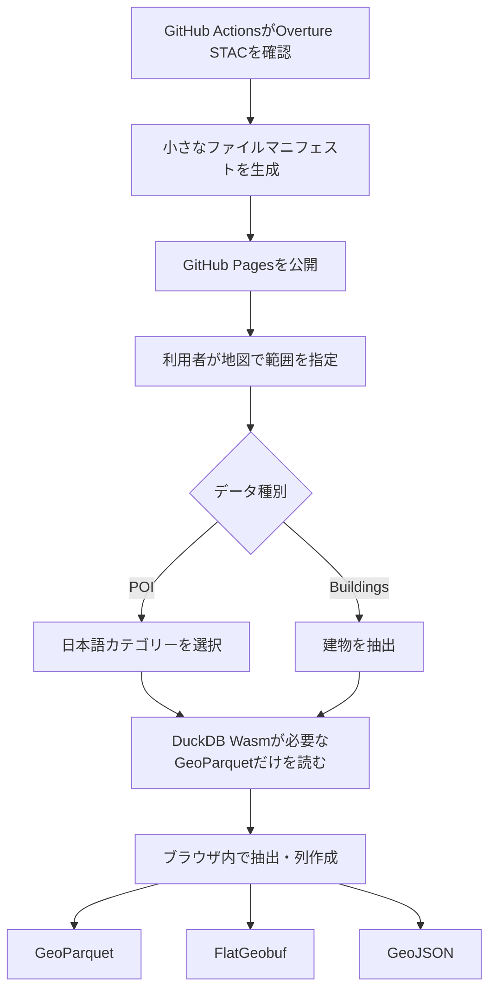

# Overture Maps データ取得

Overture MapsのPOIとBuildingsを、地図またはbboxで範囲指定して取得する日本語Webアプリです。GitHub Pages上で公開し、抽出処理は利用者のブラウザ内で完結します。

## 主な機能

- 地図の表示範囲またはbboxによる範囲指定
- POIとBuildingsの選択
- POIの日本語7分類と、Overture公式の全カテゴリー名からの検索・複数選択
- 対象ファイルの準備、抽出、変換、ファイル生成を示す進捗表示
- `names.primary`からの施設名作成
- POIへの次の列の追加
  - `施設名`
  - `生活機能区分`
  - `食料品アクセス区分コード`、`食料品アクセス区分`、`分類根拠`
  - `調剤サブ施設フラグ`
  - `ドラッグストアチェーン`、`スーパーマーケットチェーン`
  - Overtureの新`taxonomy`、`basic_category`、旧カテゴリー（検証用）
- GeoParquet、FlatGeobuf、GeoJSON出力
- 最新Overtureリリースへの日次追従
- アカウント登録、サーバー保存、有料APIなし

## データの流れ


```mermaid
flowchart TD
    A["GitHub ActionsがOverture STACを確認"] --> B["小さなファイルマニフェストを生成"]
    B --> C["GitHub Pagesを公開"]
    C --> D["利用者が地図で範囲を指定"]
    D --> E{"データ種別"}
    E -->|POI| F["日本語カテゴリーを選択"]
    E -->|Buildings| G["建物を抽出"]
    F --> H["DuckDB Wasmが必要なGeoParquetだけを読む"]
    G --> H
    H --> I["ブラウザ内で抽出・列作成"]
    I --> J["GeoParquet"]
    I --> K["FlatGeobuf"]
    I --> L["GeoJSON"]
```

## 無料で運用できる理由

GitHub PagesはHTML、CSS、JavaScriptとマニフェストだけを配信します。Overtureの元データや利用者が作成したファイルをGitHubへ保存しません。DuckDB WasmがOverture公式の公開GeoParquetを必要な範囲だけ読み、完成ファイルを利用者のブラウザから直接保存します。

## 制限

- POIは概算15,000 km²以下、Buildingsは概算3,000 km²以下に制限しています。
- FlatGeobufとGeoJSONはブラウザのメモリを考慮し、20万件以下に制限しています。
- それを超えるデータにはGeoParquetを使用してください。
- 公共交通など一部のOvertureカテゴリーは、日本国内の全施設を網羅するものではありません。
- Overtureのカテゴリーやスキーマ変更により、分類設定の更新が必要になる場合があります。

## 食料品アクセス分類

農林水産省の食料品アクセスマップの業態区分を踏まえ、1「生鮮食料品専門小売店」、2「百貨店・総合スーパー・食料品スーパー」、3「ドラッグストア」、4「コンビニエンスストア」、5「農産物直売所・ファーマーズマーケット」、9「その他の専門食料品店」、0「判定保留・除外」を付与します。

分類はOvertureの新taxonomyを優先します。新taxonomyで`grocery_store`に統合されたスーパーと、`pharmacy`に入ったドラッグストアは店舗名辞書で補います。ドラッグストア辞書はJACDS会員企業と各グループ公式情報を基礎に、北海道から沖縄までの地域ブランドを収録しています。調剤窓口などのサブPOIは重複を避けるため区分0とします。

名称辞書による分類は推定です。開店・統合・屋号変更や表記揺れがあるため、分析時は`分類根拠`と原カテゴリーも確認してください。

分類設計の主な参照先:

- [農林水産省 食料品アクセス（買い物弱者・買い物難民等）問題ポータルサイト](https://www.maff.go.jp/j/shokusan/eat/access_genjo.html)
- [Overture Maps Places Taxonomy](https://docs.overturemaps.org/guides/places/taxonomy/)
- [日本チェーンドラッグストア協会 会員リスト](https://jacds.gr.jp/member-hp/)
- [ツルハホールディングス グループ企業一覧](https://www.tsuruha-hd.co.jp/company/list/)

## ローカル開発

Node.js 22とPython 3.12を使用します。

```bash
npm install
python scripts/update_manifest.py
npm run dev
```

テストと本番ビルドは次のとおりです。

```bash
npm test
npm run build
```

## GitHub Pages

`.github/workflows/deploy-pages.yml`が次の場合にビルドと公開を行います。

- `main`へのpush
- 手動実行
- 日次スケジュール

リポジトリのSettings → Pages → Sourceを`GitHub Actions`に設定してください。

## データとライセンス

- Overture Maps data: Overture Maps Foundation
- OpenStreetMap: © OpenStreetMap contributors
- アプリケーションコード: MIT License

Overtureのテーマ別ライセンスと帰属表示は、[公式のAttribution and Licensing](https://docs.overturemaps.org/attribution/)を確認してください。

## プライバシー

このアプリは利用者登録、アクセス範囲の保存、取得ファイルのアップロードを行いません。抽出条件と完成データは利用者のブラウザ内だけで処理されます。
